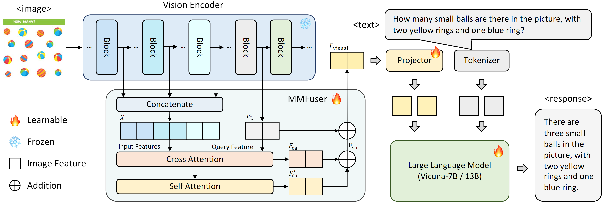
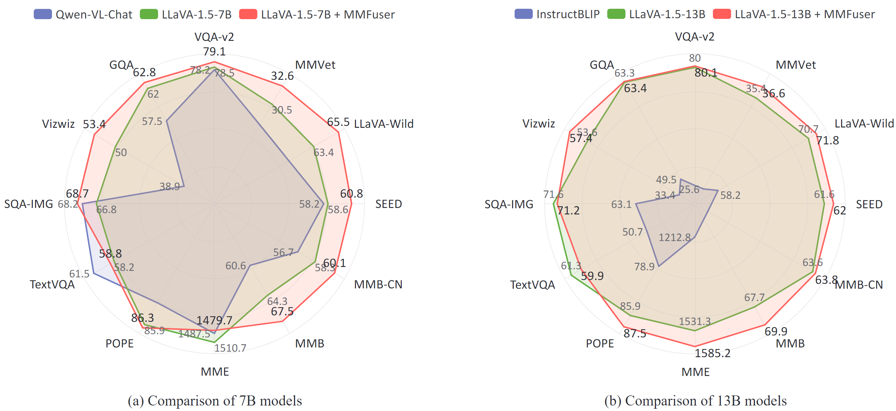

<h2 align="center">MMFuser: Multi-Modal Multi-Layer Feature Fuser</h2>

<div align="center">

English | [简体中文](README_CN.md)

</div>

## 📣 News

- **[May 30, 2024]**  🔥🔥🔥 Code has been released.

## Table of Contents
- [Overview](#overview)
- [Performance](#performance)
- [Install](#install)
- [Training](#training)
- [Evaluation](#evaluation)

## Overview

<p align="center">
    </a>
</p>

Compared to the previous architecture:
(a) CLIP only: Only a single layer of visual features is utilized, such as the second-to-last layer;
(b) Hybrid: Integrate multiple visual encoders to enhance image representation;
(c) MMFuser (Ours): Multi layer feature fusion module, used to process image features from different layers of the visual backbone (such as CLIP).


<p align="center">
    </a>
</p>

**MMFuser** is designed for **M**ulti-modal **M**ulti-layer feature fusion, which can enhance vision representation of MLLMs. The features from the last few layers of CLIP, while aligned with text, lack detailed information. In contrast, the output features from the shallow and intermediate layers contain more image details, but have poor semantic alignment.Therefore, our MMFuser employs the output features from the last layers of CLIP as *queries* ($Q$) and the features from the shallow and intermediate layers as *keys* ($K$) and *values* ($V$) to improve the semantic alignment of the previous layers. By applying attention mechanism, we fuse multiple layers of features to obtain image representations that are both richly detailed and text-aligned.

## Performance

<p align="center">
    </a>
</p>

Performance comparison of different model sizes. (left) Compared with 7B models including
Qwen-VL-Chat, LLaVA-1.5-7B, our model achieves SoTA on 11 out of 12 benchmarks, an average score of 61.8 vs 60.3(LLaVA-1.5-7B). (right) Compared with 13B models, including InstructBLIP, LLaVA-1.5-13B, our model achieves SoTA on 10 out of 12 benchmarks, an average score of 64.1 vs 63.2(LLaVA-1.5-7B). 


Comparison with state-of-the-art VLLMs on traditional VQA benchmarks and recent Multi-modal benchmarks. The best results are marked in **bold**, and the second best results are <u>underlined</u>.

<p align="center">
    </a>
</p>

After adding MMFuser, the performance of LLaVA-1.5 was greatly improved, surpassing LLaVA-1.5 on multiple benchmarks. 
Specifically, the scores on Vizwiz, MME and MMBench are 57.4,
1585.2 and 69.9, surpassing LLaVA-1.5 by 3.8, 53.9 and 2.2 points respectively.

More benchmarks are in testing.

## Install

1. Clone this repository and navigate to MMFuser folder
    ```bash
    git clone git@github.com:yuecao0119/MMFuser.git
    cd MMFuser
    ```

2. Install Package

    Our project is based on [LLaVA-1.5](https://github.com/haotian-liu/LLaVA) and creates relevant environments according to [LLaVA-1.5 Install](https://github.com/haotian-liu/LLaVA?tab=readme-ov-file#install).

    ```bash
    conda create -n MMFuser python=3.10 -y
    conda activate MMFuser
    pip install --upgrade pip  # enable PEP 660 support
    pip install -e .
    ```

3. Install additional packages

    Flash-Attention is needed.

    ```bash
    pip install -e ".[train]"
    pip install flash-attn==2.3.6 --no-build-isolation
    ```

    Deformation-Attention in [Deformation-DETR](https://github.com/fundamentalvision/Deformable-DETR/tree/main) is used in our Project. Run the following scripts to Compiling CUDA operators.

    ```bash
    cd llava/model/multimodal_projector/deformable_attention/ops
    sh ./make.sh
    ```


## Training
Our training pipeline and datasets  are directly borrowed from [LLaVA-v1.5](https://github.com/haotian-liu/LLaVA). The training consists of two stages: 
- *Pretraining*: Train a projector on a subset of ~558K image-text pairs to connect a frozen pretrained vision encoder and a frozen LLM.
    ```bash
    sh scripts/mmfuser/pertrain.sh
    ```
- *Instruction Tuning*: Fine tune the entire MLLM using multimodal instruction data LLaVA-665K.
    ```bash
    sh scripts/mmfuser/finetune.sh
    ```

## Evaluation
We follow  [LLaVA-v1.5](https://github.com/haotian-liu/LLaVA/tree/main) to conduct evaluations. you should download [eval.zip](https://drive.google.com/file/d/1atZSBBrAX54yYpxtVVW33zFvcnaHeFPy/view?usp=sharing) and unzip it to `./playground/data/eval`.  Besides, we further implement the evaluation of refcoco, mmmu and xxx. Please refer to [Evaluation.md](./docs/Evaluation.md) to prepare the data.   

Then, your can run our evaluation script in `scripts/eval`. 

And you can run inference with:
```bash
sh scripts/mmfuser/inference.sh
```

## 👍 Acknowledgement

- [LLaVA](https://github.com/haotian-liu/LLaVA): The codebase we built upon.

## 🔒 License

- The majority of this project is released under the Apache 2.0 license as found in the [LICENSE](https://github.com/yuecao0119/MMFuser/blob/main/LICENSE) file.
- The service is a research preview intended for non-commercial use only, subject to the model [License](https://github.com/facebookresearch/llama/blob/main/MODEL_CARD.md) of LLaMA and [Terms of Use](https://openai.com/policies/terms-of-use) of the data generated by OpenAI. Please contact us if you find any potential violation.
