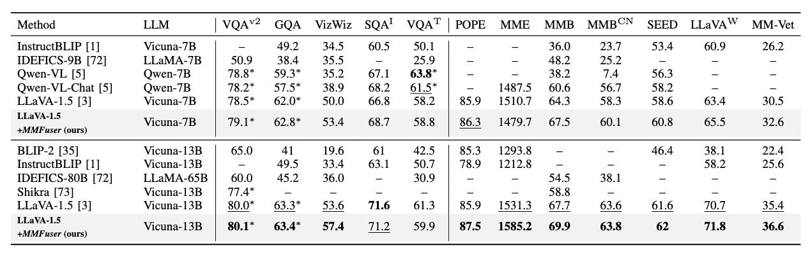
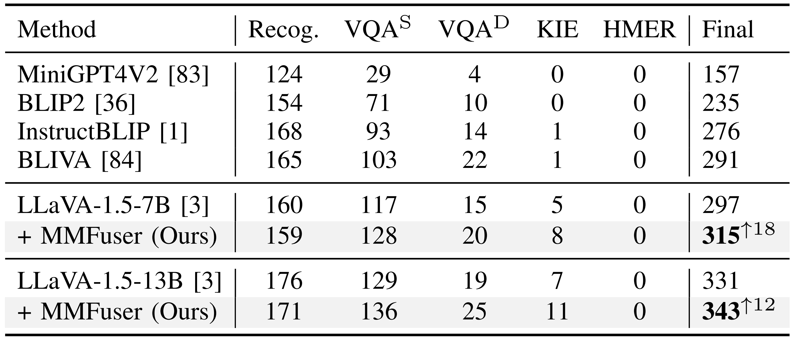
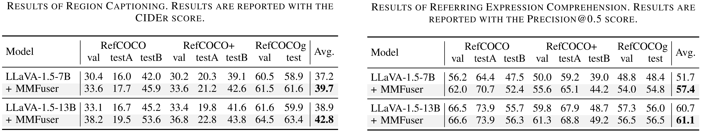
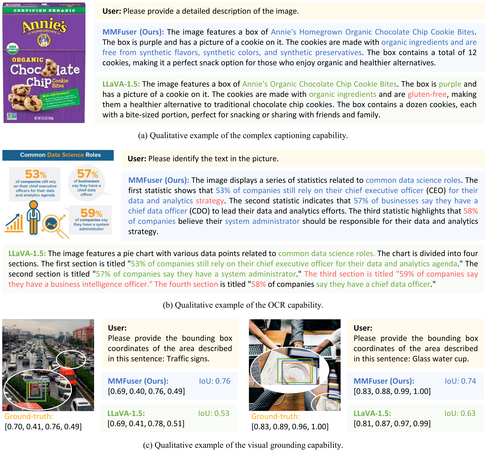

<h2 align="center">MMFuser: 用于精细视觉语言理解的多模态多层特征融合器</h2>

<div align="center">

[English](README.md) | 简体中文

</div>

文章 "[MMFuser: Multimodal Multi-Layer Feature Fuser for Fine-Grained Vision-Language Understanding](https://arxiv.org/abs/2410.11829)" 的官方实现。


## 📣 新闻

- **[10月 16, 2024]** 论文已在[arXiv](https://arxiv.org/abs/2410.11829)发布！
- **[5月 30, 2024]**  🔥🔥🔥 源码已经发布。

## 目录
- [总览](#总览)
- [效果](#效果)
- [安装](#安装)
- [训练](#训练)
- [评估](#评估)

## 总览

<p align="center">
    </a>
</p>

与以前的体系结构相比：
（a） 仅CLIP：仅使用单层视觉特征，例如倒数第二层；
（b） 混合：集成多个视觉编码器以增强图像表示；
（c） MMFuser（我们的）：一个多层特征融合模块，用于处理来自视觉主干不同层的图像特征（如CLIP）。

<p align="center">
    </a>
</p>

**MMFuser**是为**多**模态**多**层特征融合而设计的，它可以增强MLLMs的视觉表示。我们发现，CLIP最后几层的功能虽然与文本对齐，但缺乏详细信息。而与之相对的是，来自浅层和中间层的输出特征包含更多的图像细节，但语义对齐较差。因此，我们的MMFuser使用CLIP最后层的输出特征作为查询（Q），使用浅层和中间层的特征作为键（K）和值（V），来改善前面几层的语义对齐程度。通过应用注意力机制，我们融合了多层特征，以获得丰富详细并和文本对齐的图像表示。

## 效果

### 通用多模态基准测试的结果

<p align="center">
    </a>
</p>

不同模型大小的性能比较。 （左）与包括 Qwen-VL-Chat、LLaVA-1.5-7B 在内的 7B 模型相比，我们的模型在 12 个基准测试中的 11 个上实现了 SoTA。 （右）与包括 InstructBLIP、LLaVA-1.5-13B 在内的 13B 模型相比，我们的模型在 12 个基准测试中的 10 个上实现了 SoTA。

与传统 VQA 基准测试和最近的多模式基准测试上最先进的 VLLM 进行比较。最佳结果以 **粗体** 标记，第二好结果以 <u>下划线</u> 标记。

<p align="center">
    </a>
</p>

加入MMFuser后，LLaVA-1.5的性能得到了大幅提升，在多个基准测试中超越了LLaVA-1.5。
其中，在Vizwiz、MME和MMBench上的得分分别为57.4、
1585.2和69.9，分别比LLaVA-1.5高出3.8分、53.9分和2.2分。

### OCRBench 上的结果

OCRBench 是一个全面的 OCR 基准，包含 1,000 条手动整理和校正的 OCR 相关 VQA 指令。如表所示，我们的模型有 7B 和 13B 个参数，与 LLaVA-1.5 相比平均提高了 15 分。

<p align="center">
    </a>
</p>

### 区域级基准测试的结果

为了评估区域理解和基础能力，我们在两个具有代表性的区域级任务上评估了 MMFuser。

1. 区域字幕结果
在区域字幕任务中，我们的模型显示出显着的改进。如表所示，与 LLaVA-1.5 相比，MMFuser 的 7B 模型平均比 LLaVA-1.5 提高了 2.5 分，而 13B 版本则提高了 3.9 分。

2. 指称表达理解 (REC) 的结果
如表所示，我们的模型在指称表达理解基准测试中始终优于 LLaVA-1.5 模型，与 LLaVA-1.5-7B 相比，7B 模型的平均改进尤其显著，为 5.7 分。

<p align="center">
    </a>
</p>

### 视觉表现的可视化

为了直观地验证 MMFuser 对视觉特征的影响，我们在图中展示了四个示例图像的输入和输出特征图可视化。

<p align="center">
    </a>
</p>


## 安装

1. 克隆此存储库并切换到MMFuser文件夹
    ```bash
    git clone git@github.com:yuecao0119/MMFuser.git
    cd MMFuser
    ```

2. 安装程序包

    我们的项目基于[LLaVA-1.5](https://github.com/haotian-liu/LLaVA)并根据[LLaVA-1.5安装](https://github.com/haotian-liu/LLaVA?tab=readme-ov-file#install)创建相关环境。

    ```bash
    conda create -n MMFuser python=3.10 -y
    conda activate MMFuser
    pip install --upgrade pip  # enable PEP 660 support
    pip install -e .
    ```

3. 安装其他软件包

    安装Flash-Attention：

    ```bash
    pip install -e ".[train]"
    pip install flash-attn==2.3.6 --no-build-isolation
    ```

    在我们的项目中使用了[Deformation-DETR](https://github.com/fundamentalvision/Deformable-DETR/tree/main)中的可变形注意力机制。需要运行以下脚本编译CUDA算子：

    ```bash
    cd llava/model/multimodal_projector/deformable_attention/ops
    sh ./make.sh
    # unit test
    python test.py
    ```


## 训练

我们的训练管线和数据集直接取自[LLaVA-v1.5](https://github.com/haotian-liu/LLaVA). 训练包括两个阶段：
- *预训练*: 在~558K图像-文本对的子集上训练projector，以连接冻结的预训练视觉编码器和冻结的大语言模型。
    ```bash
    sh scripts/mmfuser/pertrain.sh
    ```
- *指令微调*: 利用多模态指令数据LLaVA-665K对整个MLLM进行微调。
    ```bash
    sh scripts/mmfuser/finetune.sh
    ```

## 评估

我们遵循[LLaVA-v1.5](https://github.com/haotian-liu/LLaVA/tree/main)进行评估。您应该下载[eval.zip](https://drive.google.com/file/d/1atZSBBrAX54yYpxtVVW33zFvcnaHeFPy/view?usp=sharing)，并将其解压缩到`./playground/data/eval`。请参考[Evaluation.md](./docs/Evaluation.md)准备数据。

然后，您可以在`scripts/v1_5/eval`中运行我们的评估脚本。

并且您可以通过以下代码进行模型推理：

```bash
sh scripts/mmfuser/inference.sh
```

## 👍 致谢

- [LLaVA](https://github.com/haotian-liu/LLaVA) ：我们基于该代码库改进。

## 🔒 许可证

- 该项目的大部分内容都是在[LICENSE](https://github.com/yuecao0119/MMFuser/blob/main/LICENSE)文件中的Apache 2.0许可证下发布的。
- 该服务是一个仅用于非商业用途的研究预览，受LLaMA的[License](https://github.com/facebookresearch/llama/blob/main/MODEL_CARD.md)模型和OpenAI生成的数据的[Terms of Use](https://openai.com/policies/terms-of-use)约束。如果您发现任何潜在的违规行为，请与我们联系。

## 引用

如果这项工作对您的研究有帮助，请考虑引用以下 BibTeX 条目。

```
@article{cao2024mmfuser,
  title={MMFuser: Multimodal Multi-Layer Feature Fuser for Fine-Grained Vision-Language Understanding},
  author={Cao, Yue and Liu, Yangzhou and Chen, Zhe and Shi, Guangchen and Wang, Wenhai and Zhao, Danhuai and Lu, Tong},
  journal={arXiv preprint arXiv:2410.11829},
  year={2024}
}
```
